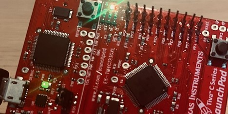

# RTOS Demo on EK-TM4C123GXL (Cortex-M4) — uC/OS-II Active Object



This project demonstrates a simple real-time system on the EK-TM4C123GXL board using a minimal Active Object (AO) layer on top of **uC/OS-II**.  
It blinks the green LED on a periodic timer and adjusts the blink rate with **SW1** (blue LED indicates button state). The design showcases event-driven AOs, time events, and RTOS tick integration.

---

## 📂 Repository Layout


|  
├── Application/                 # Your application logic (main, bsp)  
|  
├── ucos2/               		     # CMSIS core headers  
|  
├── ucos2_ports/               		     # CMSIS core headers  
|
├── ek-tm4c123gxl/               # Board/Microcontroller-specific files  
|  
├── targetConfig/                # Target Configurations  

---

##🛠 Build & Run Instructions

### Prerequisites

- **Code Composer Studio (CCS)** or GCC ARM toolchain  
- **TivaWare SDK** (not included in repo)  
- **µC/OS-II (V2.93)** included in this repo under ucos2/
- **CMSIS headers** (either from this repo or your local installation)

### Importing in CCS

1. **Import project**:
  - `File → Import CCS Projects` → select this repo’s root folder.
2. **Tivaware path setting**:
	-When prompted, set build variable in Project Properties → C/C++ Build → Build Variables:
		•	Name: TIVAWARE_ROOT
		•	Value: your TivaWare path (e.g. C:/ti/TivaWare_C_Series-2.2.0.295)
2. **Include path setup**:
   - Add paths in Project Properties → CCS Build → GNU Compiler → Directories:
     ```
     ${ProjDirPath}/Application
     ${ProjDirPath}/CMSIS/include
     ${ProjDirPath}/ek-tm4c123gxl
     ${ProjDirPath}/ucos2
     ${ProjDirPath}/ucos2_ports
     ${TIVAWARE_ROOT}
     ```
3. **Build configuration**: Only one kernel compilation model is used:
✅ Include: ucos2/ucos_ii.c
🚫 Exclude: all other ucos2/os_*.c files
(This is already set in the project so it builds right away.)
4. **Linker script (if needed)**: Uses ek-tm4c123gxl/lesson.ld (custom script included).
5. **Build and flash** — connect the LaunchPad, flash via CCS.

## 📄 License & Credits

	•	µC/OS-II Kernel: Apache-2.0 license (© Silicon Labs)
	•	uC/AO Framework & Application Code: Apache-2.0 / educational adaptation
	•	Based on concepts from Quantum Leaps — Modern Embedded Programming (M. Samek)
	•	See individual file headers for SPDX identifiers.

## ✨ Author
**Alexandre Panhaleux**  
Embedded Software Engineer  
[GitHub: @alexandrephl](https://github.com/alexandrephl)
